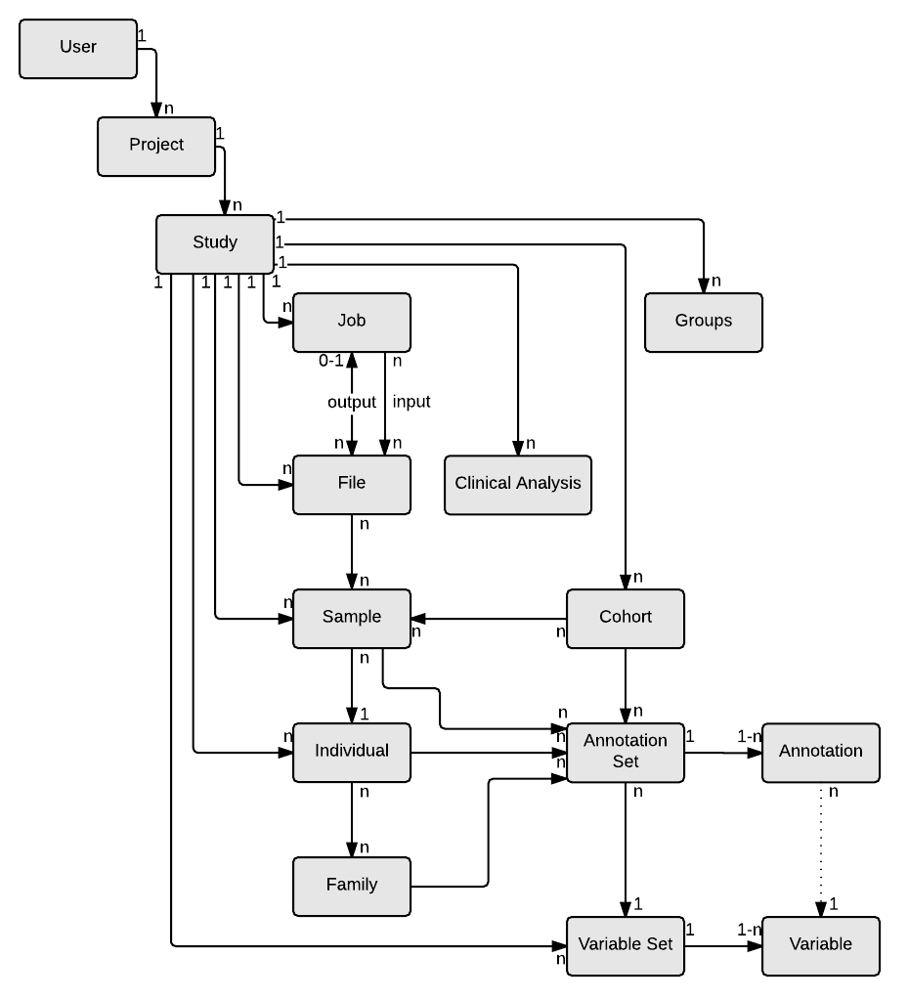

# Data Models

## Design Principles

All OpenCGA Data Models have been designed to follow some principles:

1. Parent-Child List
2. Chid-Parent reference
3. Annotation Sets

## Implementation

### Diagram

Legend:

* U - Unique
* M - Mandatory
* I - Immutable

## Common Data Models

### Annotation Set

| Field | Description |
| :--- | :--- |
|  |  |

### Phenotype

Describe a phenotype following an OBO ontology.

<table>
  <thead>
    <tr>
      <th style="text-align:left">Field</th>
      <th style="text-align:left">Description</th>
    </tr>
  </thead>
  <tbody>
    <tr>
      <td style="text-align:left">
        
<b>id</b>
        

        
<em>String</em>
        

      </td>
      <td style="text-align:left"></td>
    </tr>
    <tr>
      <td style="text-align:left">
        
<b>name</b>
        

        
<em>String</em>
        

      </td>
      <td style="text-align:left"></td>
    </tr>
    <tr>
      <td style="text-align:left">
        
<b>source</b>
        

        
<em>String</em>
        

      </td>
      <td style="text-align:left"></td>
    </tr>
    <tr>
      <td style="text-align:left">
        
<b>ageOfOnset</b>
        

        
<em>String</em>
        

      </td>
      <td style="text-align:left"></td>
    </tr>
    <tr>
      <td style="text-align:left">
        
<b>status</b>
        

        
<em>Status</em>
        

      </td>
      <td style="text-align:left"></td>
    </tr>
    <tr>
      <td style="text-align:left">
        
<b>attributes</b>
        

        
<em>Map</em>
        

      </td>
      <td style="text-align:left"></td>
    </tr>
  </tbody>
</table>

### Creation and Modification Date

### Status

### File ID

File IDs contain the path using `:`

